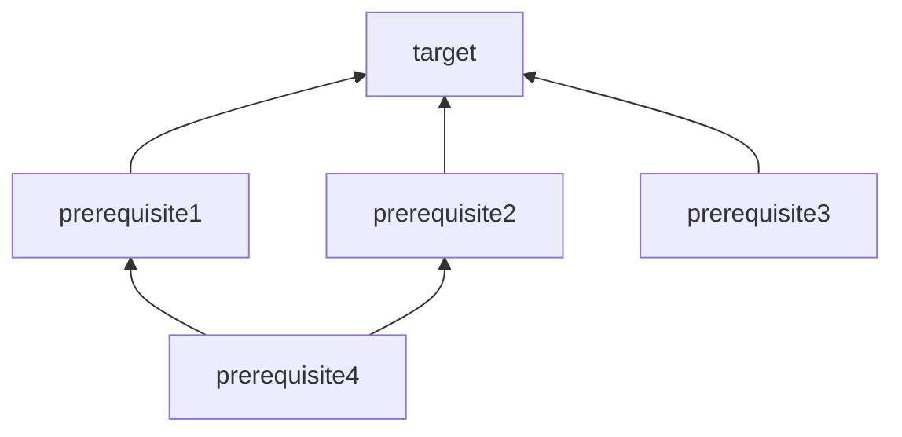

# Makefile Essentials for Data Science Projects
A set of notes and Makefiles examples.

# Table of Contents

1.  [Uses](#uses)
2.  [Basic Concepts](#basic-concepts)
3.  [Special Targets](#special-targets)
4.  [Automatic Variables](#automatic-variables)
5.  [Text Functions](#text-functions)
6.  [Execution](#execution)
7.  [Debugging](#debugging)
8.  [More Elegant Options](#more-elegant-options)
9.  [Standard Targets](#standard-targets)
10. [Non-standard Targets](#non-standards-targets)
11. [Examples](#examples)
12. [References](#references)

## Uses

1.  **Reproducible Research**: useful for sharing a complete analysis
    (code, data, workflows, report) with collaborators and readers of a
    final article.
2.  **Task Dependency Management**: Make determines which targets needs
    to be rebuilt based on their dependencies changes. Therefore, you
    can save time avoid running the entire pipeline after a change.
3.  **Pipeline Documentation**: By explicitly recording the inputs to
    and outputs from steps in the analysis and the dependencies between
    files, Makefiles act as a type of documentation, reducing the number
    of things we have to remember.

## Basic Concepts

Make is a build automation tool to build targets based on recipes:

1.  **Targets:** what to build (a file or a phony target)
2.  **Rules:** how to build the target
3.  **Prerequisites (optional):** dependencies

``` bash
target: prerequisite1 prerequisite2 prerequisite3
<tab>   command_A
<tab>   command_B

prerequisite1: prerequisite4
<tab>   command_C

prerequisite2: prerequisite4
<tab>   command_D

prerequisite4:
<tab>   command_E
```

To perform a build, make will construct a direct acyclic graph (DAG)
from the rules.



By default, when you type `make` it will try to find a Makefile with the
following names, in order: **GNUmakefile**, **makefile** and
**Makefile** (the most common one).

You can also call it differently but you need to run it as
`make -f mymakefile`.

## [Special Targets](https://www.gnu.org/software/make/manual/html_node/Special-Targets.html)

**.PHONY**

The prerequisites of the special target .PHONY are considered to be
phony targets. When it is time to consider such a target, make will run
its recipe unconditionally, regardless of whether a file with that name
exists or what its last-modification time is.

``` bash
.PHONY: all target1 target2 target3 clean

OUTDIR = output

all: target1 target2 

target1: prerequisite1
<tab>   command_A

target2: prerequisite1
<tab>   command_B

clean:
<tab>   rm -rf $(OUTDIR)
```

**.EXPORT_ALL_VARIABLES**

Simply by being mentioned as a target, this tells make to export all
variables to child processes by default.

**.DELETE_ON_ERROR**

Delete the target of a rule if it has changed and its recipe exits with
a nonzero exit status.

**.ONESHELL**

When a target is built all lines of the recipe will be given to a single
invocation of the shell.

**.DEFAULT_GOAL**

By default, the goal is the first target in the makefile, you can use
DEFAULT_GOAL to change this behaviour.

## [Automatic Variables](https://www.gnu.org/software/make/manual/html_node/Automatic-Variables.html)

### \*\*\$@*\*

The file name of the target of the rule.

``` bash
target1: prerequisite1
<tab>   echo $@
```

Will print `target1`.

### **\$\<**

The name of the first prerequisite.

``` bash
target1: prerequisite1 prerequisite2
<tab>   echo $<
```

Will print `prerequisite1`.

### **\$\***

The stem with which an **implicit rule** matches.

``` bash
$(OUTDIR)/my_%_file.csv: prerequisite1 
<tab>   echo $*
```

If in the folder OUTDIR you have a csv file called `my_first_file.csv`,
this will print `first`.

## [Text Functions](https://www.gnu.org/software/make/manual/html_node/Text-Functions.html)

**Wildcards**

``` bash
CSVS = $(wildcard *.csv)
```

**String Substitution**

Remember not adding spaces between commas:

``` bash
$(subst apples,oranges,I love apples)
```

**Pattern Substitution**

``` bash
INPUTDIR = data
OUTPUTDIR = output
CSVS = $(wildcard $(DATA)/*.csv)
INPUTFILES = $(CSVS:%.csv=$(INPUTDIR)/%.csv)
OUTPUTFILES = $(CSVS:%.csv=$(OUTPUTDIR)/%.csv)
```

which is equivalent to:

``` bash
INPUTDIR = csv
CSVS = $(wildcard *.csv)
INPUTFILES = $(patsubst %.csv,$(INPUTDIR)/%.csv,$(CSVS))
```

## [Execution](https://www.gnu.org/software/make/manual/html_node/Options-Summary.html)

**Parallel Execution**

You can use `-j` to run in parallel (limited to number of CPUs and RAM
available) or specify the number of parallel processes `N`.

``` bash
make -j
make -j N
```

**Always make**

Forces make to ignore existing targets

``` bash
make target1 -B
```

**Keep Going**

Continue as much as possible after an error.

``` bash
make target1 -k
```

## Debugging

Print a variable

``` bash
$(info $(MYVAR))
```

Dry run: Use the "just print" option

``` bash
make -n
```

or combine it with the always make option

``` bash
make -Bn
```

## More Elegant Options

-   Use `@` before a command to suppress its output
-   Define your programs as variables

``` bash
PYTHON = @python3
R = @Rscript

target1:
<tab>   $(R) myscript.R

target2:
<tab>   $(PYTHON) myscript.python
```

## [Standard Targets](https://www.gnu.org/software/make/manual/html_node/Goals.html)

-   `all`: Make all the top-level targets the makefile knows about.
-   `clean`: Delete all files that are normally created by running make.
-   `install`: this generally copy the executable file into a directory
    that users typically search for commands.
-   `test`: Perform self tests on the program this makefile builds.

## Non-standards Targets

-   `venv`: creates a virtual environment

-   `help`: it might be usefult to achieve a self-documented Makefile.

    ``` bash
    .PHONY: help
    help:
    <tab>   @echo Run a simulation and generate a report
    <tab>   @echo sim         : run only the simulation
    <tab>   @echo report      : generate a report
    <tab>   @echo clean       : delete simulation and report
    ```

-   `variables`: you could also create a target to print variables.

    ``` bash
    .PHONY : variables
    variables:
    <tab>   @echo INPUT_DIR: $(INPUT_DIR)
    <tab>   @echo CSV_FILES: $(CSV_FILES)
    ```

    ## Examples

-   [01-includes](https://github.com/mapsa/makefile-examples/tree/main/01-includes):
    this example shows the use of includes to manage a set of scenarios
    as configuration files.

-   [02-quarto-params](https://github.com/mapsa/makefile-examples/tree/main/02-quarto-params):
    running a quarto document accepting params defined in the Makefile.

-   [03-quarto-slides](https://github.com/mapsa/makefile-examples/tree/main/03-quarto-slides):
    creating slides as pdf and powerpoint from a quarto document.

-   [04-latex](https://github.com/mapsa/makefile-examples/tree/main/04-latex):
    compile a LaTeX document.

-   [05-functions](https://github.com/mapsa/makefile-examples/tree/main/05-functions):
    how to create targets dinamically using `define`.

-   [06-conda](https://github.com/mapsa/makefile-examples/tree/main/06-conda):
    create and activate conda environments

## References

-   <https://www.gnu.org/software/make/manual/html_node/index.html>
-   <https://www.oreilly.com/library/view/managing-projects-with/0596006101/>
-   <https://the-turing-way.netlify.app/reproducible-research/make.html>
-   <https://gertjanvandenburg.com/files/talk/make.html>

<div>

> **Note**
>
> A website view of this repo can be seen
> [here](https://mapsa.github.io/makefile-examples). The repo is
> available [here](https://github.com/mapsa/makefile-examples/).

</div>
