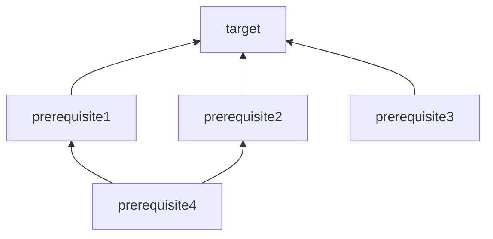

# Makefile Essentials for Data Science Projects

A set of notes and Makefiles examples.

# Table of Contents
1. [Uses](#uses)
1. [Basic Concepts](#basic-concepts)
1. [Special Targets](#special-targets)
1. [Automatic Variables](#automatic-variables)
1. [Execution](#execution)
1. [Debugging](#debugging)
1. [More Elegant Options](#more-elegant-options)
1. [References](#references)

## Uses

1. **Reproducible Research**
1. **Task Dependency Management**
1. **Pipeline Documentation**

## Basic Concepts

Make is a build automation tool to build targets based on recipes:

1. **Targets:** what to build (a file or a phony target)
1. **Rules:** how to build the target
1. **Prerequisites (optional):** dependencies

```bash
target: prerequisite1 prerequisite2 prerequisite3
<tab>   command_A
<tab>   command_B

prerequisite1: prerequisite4
<tab>   command_C

prerequisite2: prerequisite4
<tab>   command_D

prerequisite4:
<tab>   command_E
```

To perform a build, make will construct a direct acyclic graph (DAG) from the rules.




By default, when you type `make` it will try to find a Makefile with the following names, in order: **GNUmakefile**, **makefile** and **Makefile** (the most common one). 

You can also call it differently but you need to run it as `make -f mymakefile`.


## [Special Targets](https://www.gnu.org/software/make/manual/html_node/Special-Targets.html)

**.PHONY**

The prerequisites of the special target .PHONY are considered to be phony targets. When it is time to consider such a target, make will run its recipe unconditionally, regardless of whether a file with that name exists or what its last-modification time is. 

```bash
.PHONY: all target1 target2 target3 clean

OUTDIR = output

all: target1 target2 

target1: prerequisite1
<tab>   command_A

target2: prerequisite1
<tab>   command_B

clean:
<tab>   rm -rf $(OUTDIR)
```

**.EXPORT_ALL_VARIABLES**

Simply by being mentioned as a target, this tells make to export all variables to child processes by default.

**.DELETE_ON_ERROR**

Delete the target of a rule if it has changed and its recipe exits with a nonzero exit status.

**.ONESHELL**

 When a target is built all lines of the recipe will be given to a single invocation of the shell.

## [Automatic Variables](https://www.gnu.org/software/make/manual/html_node/Automatic-Variables.html)

### **$@**

The file name of the target of the rule. 

```bash
target1: prerequisite1
<tab>   echo $@
```
Will print `target1`.

### **$<**

The name of the first prerequisite.

```bash
target1: prerequisite1 prerequisite2
<tab>   echo $<
```
Will print `prerequisite1`.


### **$\***

The stem with which an **implicit rule** matches.

```bash
$(OUTDIR)/my_%_file.csv: prerequisite1 
<tab>   echo $*
```
If in the folder OUTDIR you have a csv file called `my_first_file.csv`, this will print `first`.


## [Execution](https://www.gnu.org/software/make/manual/html_node/Options-Summary.html)

**Parallel Execution**

You can use `-j` to run in parallel (limited to number of CPUs and RAM available) or specify the number of parallel processes `N`. 
```bash
make -j
make -j N
```

**Always make**

Forces make to ignore existing targets

```bash
make target1 -B
```

**Keep Going**

Continue as much as possible after an error. 

```bash
make target1 -k
```

## Debugging

Print a variable

```bash
$(info $(MYVAR))
```

Use the "just print" option
```bash
make -n
```

or combine it with the always make option

 ```bash
make -Bn
```

## More Elegant Options

- Use `@` before a command to suppress its output
- Define your programs as variables
```
PYTHON = @python3
R = @Rscript

target1:
<tab>   $(R) myscript.R

target2:
<tab>   $(PYTHON) myscript.python
```
- Start your makefile with a phony target called `all`
- Finish your makefile with a phony target called `clean` 
- Ideally include a phony target called `test`

## References

- https://www.gnu.org/software/make/manual/html_node/index.html
- https://www.oreilly.com/library/view/managing-projects-with/0596006101/

